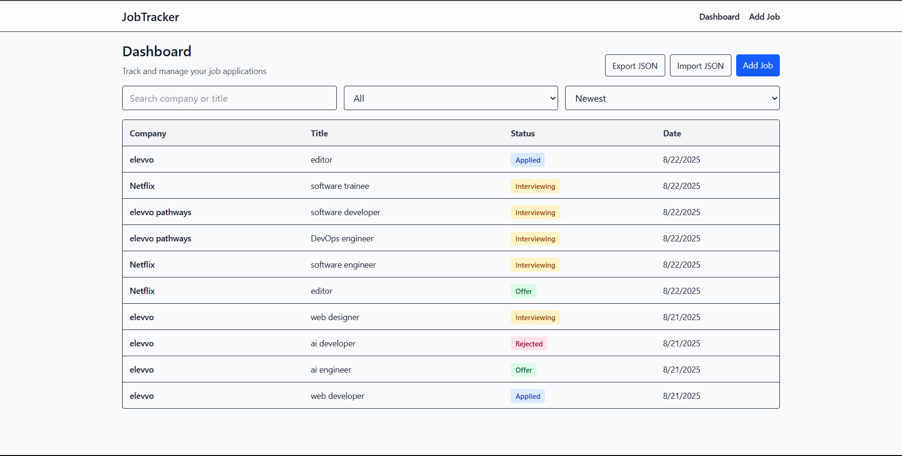

# Job Application Tracker

A modern, responsive web application to track and manage job applications. Built with React and Vite, it features a clean design, intuitive navigation, and tools for organizing applications across different stages.

## 🚀 Features

- **Responsive Design**: Mobile-first layout styled with Tailwind CSS
- **Application Management**: Add, edit, and track job applications easily
- **Status Tracking**: Organize applications by stages (Applied, Interviewing, Offer, Rejected)
- **Search & Filtering**: Quickly find applications by keywords or status
- **Navigation**: Built with React Router for smooth page transitions
- **Modern UI**: Clean and intuitive interface with React components



## 🛠️ Tech Stack

- **Frontend Framework**: React 19.1.1
- **Routing**: React Router DOM 7.8.1
- **Build Tool**: Vite 7.1.2
- **Styling**: Tailwind CSS 4.1.12
- **Linting**: ESLint 9.33.0
- **Language**: JavaScript (JSX)

## 📋 Prerequisites

Before running this project, make sure you have the following installed:

- **Node.js** (version 16 or higher)
- **npm** (comes with Node.js) or **yarn**

You can check your Node.js version by running:
```bash
node --version
npm --version
```

## 🚀 Getting Started

### 1. Clone the Repository

```bash
git clone https://github.com/hooriaajmal/jobtracker.git
cd jobtracker
```

### 2. Install Dependencies

```bash
npm install
```

### 3. Start the Development Server

```bash
npm run dev
```

The application will be available at `http://localhost:5173`.

### 4. Build for Production

```bash
npm run build
```

This creates a `dist` folder with optimized production files.

### 5. Preview Production Build

```bash
npm run preview
```

## 📁 Project Structure

```
jobtracker/
├── public/                # Static assets
├── src/
│   ├── components/        # React components (Header, ApplicationCard, etc.)
│   ├── pages/             # Page components (Dashboard, Applications, etc.)
│   ├── App.jsx            # Main app component
│   ├── main.jsx           # Application entry point
│   └── index.css          # Global styles
├── index.html             # HTML template
├── package.json           # Dependencies and scripts
├── vite.config.js         # Vite configuration
├── tailwind.config.js     # Tailwind configuration
└── eslint.config.js       # ESLint configuration
```

## 🎯 Available Scripts

- `npm run dev` - Start development server
- `npm run build` - Build for production
- `npm run preview` - Preview production build
- `npm run lint` - Run ESLint to check code quality

## 🎨 Features in Detail

### Application Management
- Add new job applications with details like company, role, and status
- Edit or delete applications
- Organize applications in different stages

### Search & Filtering
- Search applications by company name or role
- Filter applications by status

### Status Tracking
- Keep track of where each application stands (Applied, Interviewing, Offer, Rejected)
- Update status easily as you progress

### Responsive Design
- Mobile-first approach
- Grid layout adapts to screen size
- Optimized for desktop, tablet, and mobile

## 🚀 Deployment

### Deploy to Vercel
1. Push your code to GitHub
2. Connect your repository to Vercel
3. Vercel will automatically build and deploy your site

### Deploy to Netlify
1. Build your project: `npm run build`
2. Upload the `dist` folder to Netlify
3. Configure build settings if needed

### Deploy to GitHub Pages
1. Add this to your `package.json`:
```json
{
  "homepage": "https://hooriaajmal.github.io/jobtracker",
  "scripts": {
    "predeploy": "npm run build",
    "deploy": "gh-pages -d dist"
  }
}
```
2. Install gh-pages: `npm install --save-dev gh-pages`
3. Deploy: `npm run deploy`

## 🤝 Contributing

1. Fork the repository
2. Create a feature branch: `git checkout -b feature-name`
3. Commit your changes: `git commit -am 'Add feature'`
4. Push to the branch: `git push origin feature-name`
5. Submit a pull request

## 👤 Author

**Hooria Ajmal**
- GitHub: [@hooriaajmal](https://github.com/hooriaajmal)
- Email: hooriaajmal9@gmail.com

## 🙏 Acknowledgments

- [React](https://reactjs.org/) - A JavaScript library for building user interfaces
- [Vite](https://vitejs.dev/) - Next Generation Frontend Tooling
- [Tailwind CSS](https://tailwindcss.com/) - A utility-first CSS framework
- [React Router](https://reactrouter.com/) - Declarative routing for React

---

⭐ If you found this project helpful, please give it a star on GitHub!
